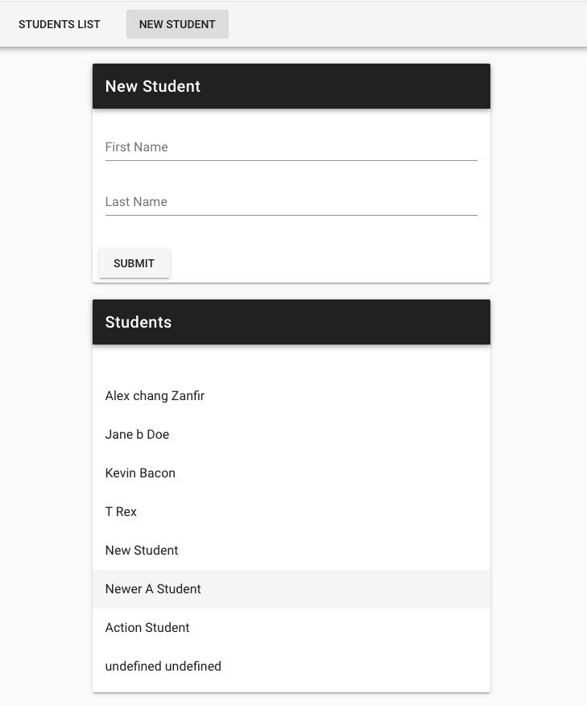

<!-- PROJECT TITLE -->
 

<h2 align="center">Learning Vuex</h3>

 Linkedin course by Alexander Zanfir

 

 

## About the project

I've followed this LinkedIn <a href="https://www.linkedin.com/learning/learning-vuex">course</a> offered by Alexander Zanfir.

This project shows how to use the state management pattern and library to more effectively handle the complexities in medium-to-large-scale Vue.js apps. This covers using getters to proces the state data, modifying data using mutations or making asynchronous calls using actions.

I am on my way to achieve a :rocket: fullstack overview!

 

 

## Built with

Major frameworks/libraries used:

- Vue
- Vuetify
- Vue-Router
- Vuex
- Json-server

 

## Vue's Lifecycle hooks

This graphic shows Vue's lifecycle hooks:

 

- <b>beforeCreate:</b> called when the instance is initialized
- <b>created:</b> called after the instance has finished processing all state-related options
- <b>beforeMount:</b> called right before the component is to be mounted
- <b>mounted: </b>called after the component has been mounted
- <b>beforeUpdate:</b> called right before the component is about to update its DOM due to reactive state change
- <b>updated: </b>called after the component has update its DOM tree due to a reactive state change
- <b>beforeUnmount:</b> called right before a component instance is to be unmounted
- <b>unmounted:</b> called after the component has been unmounted
- <b>errorCaptured:</b> called when an error propagating from a descendent component has been captured

  

## Author

I'm Marta Boteller, little more about me at my [website](https://martaboteller.com).

   

## Acknowledgments

This course was prepared with older versions of Vue and Vuetify. Minor changes have been implemented now.
  I would like to thank <a href="https://www.linkedin.com/learning/learning-vuex">Alexander Zanfir </a>for his fantastic way of teaching!

##
